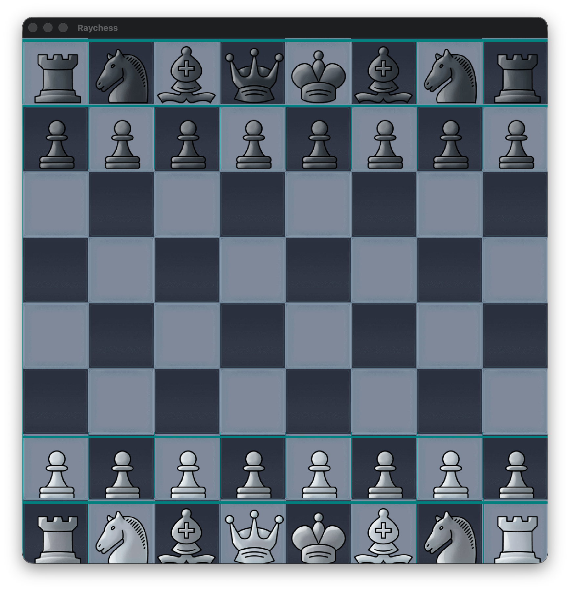

# Raychess

This is my attempt to create my own chess frontend in C with the raylib library.
My primary goal with this project is to learn common chess Data structures and algorithms using [the chess programming wiki](https://www.chessprogramming.org)
and hopefully integrate a working chess FOSS engline like [Stockfish](https://www.chessprogramming.org/Stockfish) so that i can have fun playing with it. 

